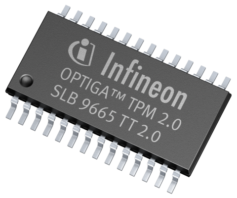
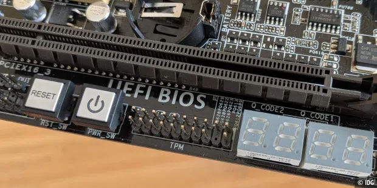
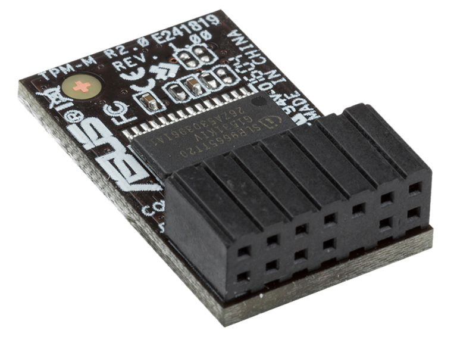
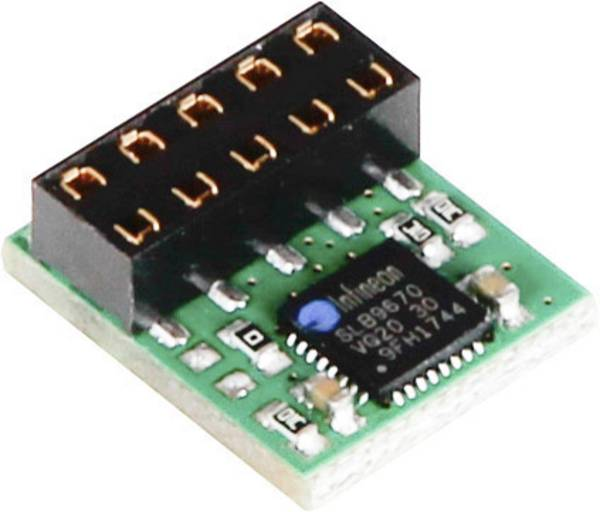
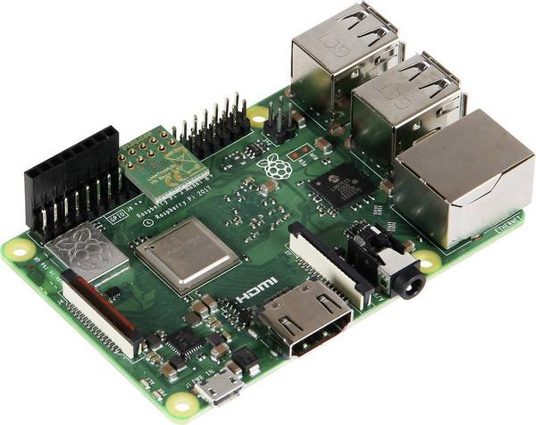
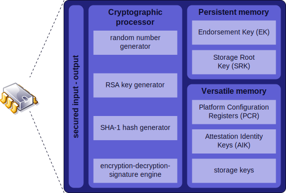

## Trusted Platform Module Foobar 🔐

IT Sec Meetup Kassel Oktober 2021

## Mattias Giese

https://github.com/mattiasgiese/tpm_talk_itsec_ks_2021

## Warum?

* Windows 11 will es haben. 🤷
* Man kann lustige Sachen damit anstellen. 🙃

## TPM - Für was ist das gut? 🤔

### Bereitstellung kryptografischer Routinen

* Zufallszahlengenerator
* Generator für private Schlüssel (RSA, AES, ECC und andere Akronyme)
* Hash-Generator (SHA-1, SHA-256)

### Verifizierung des Systemzustandes

für "Measured Boot" und (Remote-)Attestion

### Sicheres speichern von Daten

* Speichern von beliebigen™ Inhalten
* Herausgabe von Infos nur wenn System verifiziert ist

### Ein wenig Geschichte

* Trusted Computing Platform Alliance -> Trusted Computing Group (ab 2003)
* Grundidee: HW Vendors können entscheiden, welche Software auf der Hardware läuft
* Kritik: Vendor-Lockin, DRM (Remote-Attestation Horror)
* In 2009: Veröffentlichung von ISO Standards
* Ab 2014: TPM 2.0, da real TPM
* Größte Errungenschaft: TPM Specs 1.2 und 2.0

## TPM 1.2 oder TPM 2.0?

Immer TPM 2.0

## Wie sieht das Teil aus?

## Infineon SLB 9665

## AddOn Chip für Mainboards

  
  

## Let's Trust Chip für RPI

  
  

### Andere Varianten

Neben dedizierten Chips gibt es noch andere Varianten bei der Implementierung des TPM.

### Integriert in andere Chips

Manche Intel Chipsets bringen ein TPM mit.

### Firmware TPM

Läuft in einem besonders gesicherten Bereich der CPU, Teil der UEFI Firmware

### Hypervisor TPM

z.B. in qemu/KVM, Hyper-V, VMWare

### Software TPM

z.B. swtpm: https://github.com/stefanberger/swtpm (auch qemu/KVM)

## Software Stack (TSS)

* TSS = TPM Software Stack
* Verschiedene Optionen

### ibmtss

* https://sourceforge.net/projects/ibmtpm20tss/
* Open Source von IBM
* 1-to-1 Mapping der TPM Kommandos

### go-tpm

* https://github.com/google/go-tpm
* 1-to-1 Mapping, eigene Wrapper
* Benutzung in `go-attestation`

### tpm2-software TSS

* https://github.com/tpm2-software
* Entwickelt von Infineon, Intel, Fraunhofer SIT u.a.
* freie Software (BSD-style)
* Implementierung der Feature API/Enhanced System API der TPM Spec
* wird in den Demos verwendet

### Distro Support

* Fedora: 👍🥳
* Archlinux: 👍🥳
* Ubuntu 20.04: 👎
* Ubuntu 22.04: 👍
* SLES 15/RHEL 8: 👴👎

### Grundbegriffe

  

#### Endorsement Key/Certificate (EK)

* wird bei Produktion des Chips generiert -> eindeutig
* EK Public wird vom Hersteller signiert
* Zertifikat landet im Festspeicher des Chips
* kann nicht zum signieren genutzt werden (Privacy Fail)
* Ist das ein richtiger™ TPM? 🧐

#### Platform Key/Cert (PK)

* kann vom OEM hinterlegt werden
* Hardware Platform verifizieren -> ja, das ist ein Dell Server

#### Attestation Key (AK)

* früher: Attestation Identity Key (AIK)
* vom EK abgeleitet
* könnte für Remote-Attestation genutzt wird
* mehre AKs möglich (pro Service z.B.)

#### Storage Root Key (SRK)

* Schützt alle weiteren Keys
* generiert bei "Besitzübernahme"
* Nach Clear des TPM -> neuer SRK

#### Platform Configuration Registers (PCR) I/II

* Speicherort für Systeminfo/zustand
* Beim Boot mit Nullen/Einsen initialisiert
* Kann nur erweitert, nicht überschrieben werden: newval = Hash(oldval + newval)
* Anzahl der PCRs variabel, bei PC 24, in anderen Bereichen (Automotive etc.) viel mehr

#### Platform Configuration Registers (PCR) II/II

| PCR#          | Benutzung                                           |
| ------------- | -------------                                       |
| 0             | BIOS/Firmware                                       |
| 1             | BIOS Settings                                       |
| 2             | Option ROMs                                         |
| 3             | Option ROM settings                                 |
| 4             | MBR (Master Boot Record)                            |
| 5             | MBR Config                                          |
| 6             | State transitions/wake events                       |
| 7             | Manufacturer specific (Secure Boot Status)          |
